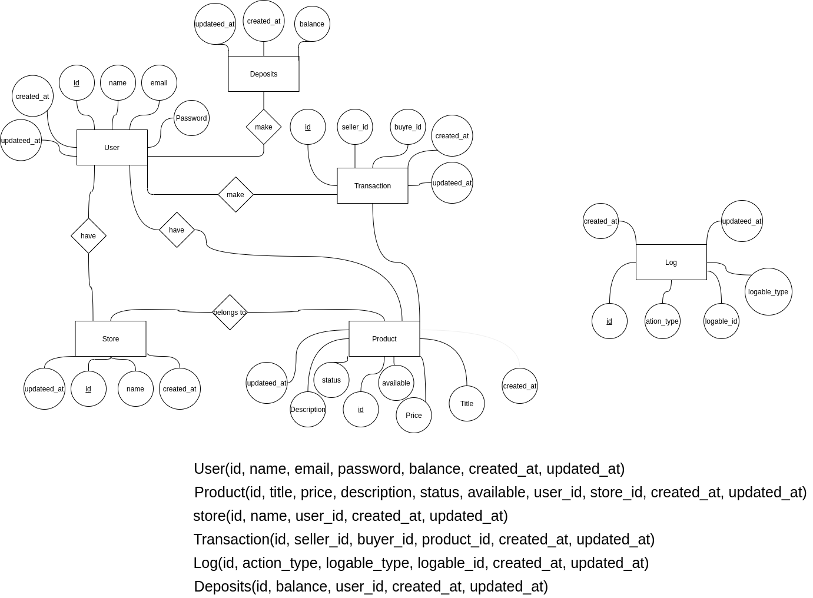
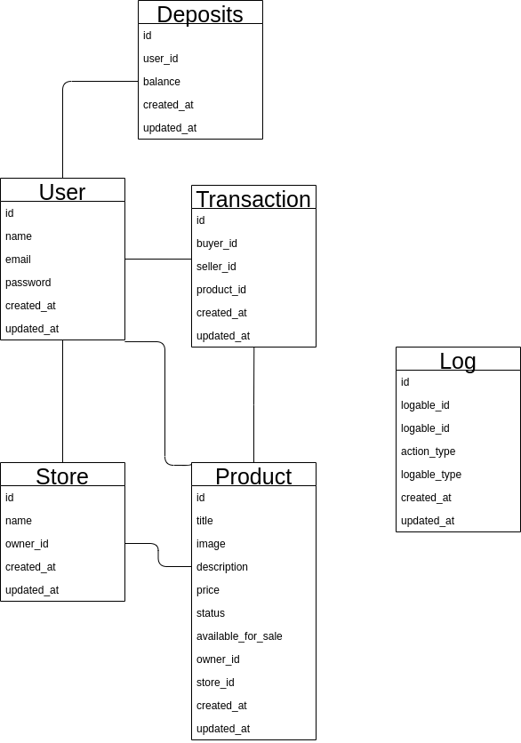
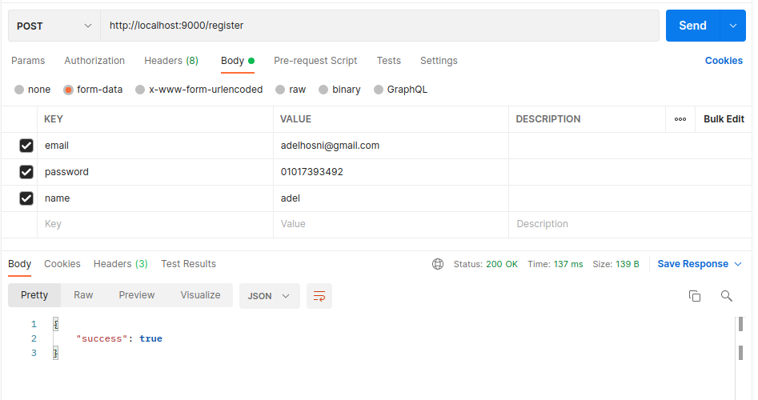
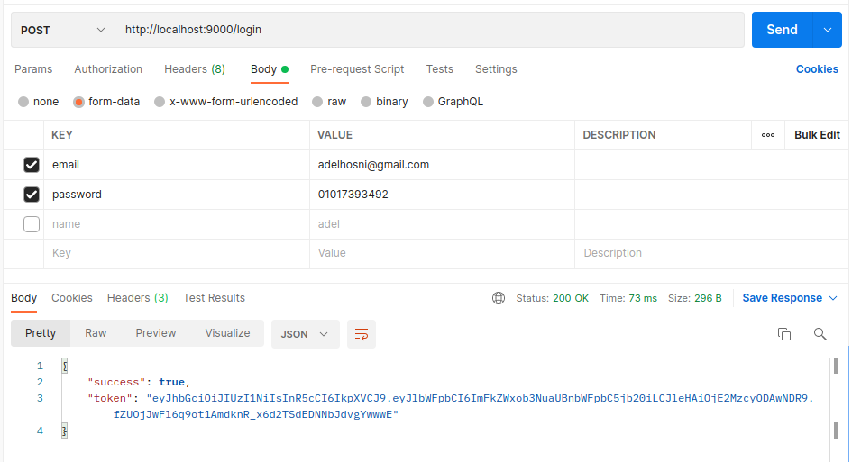
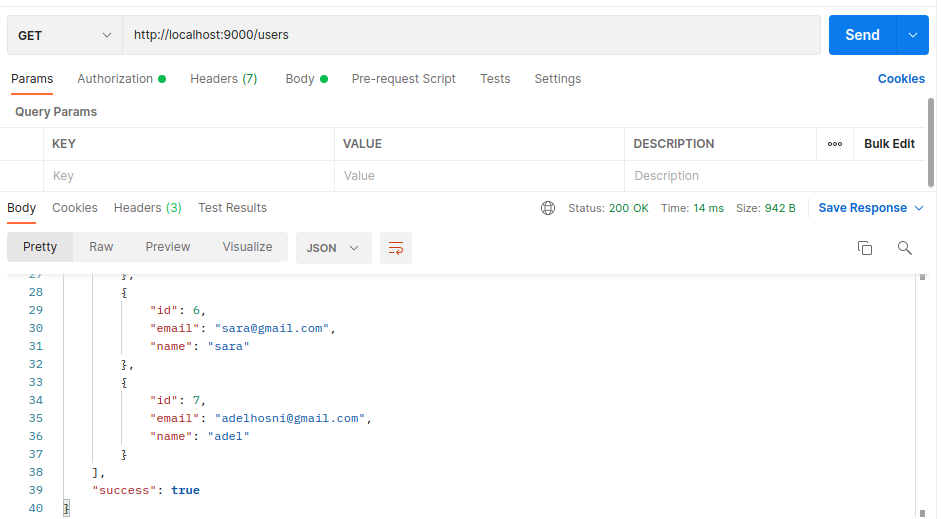
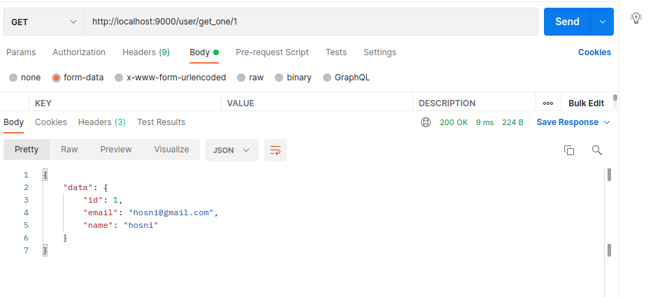
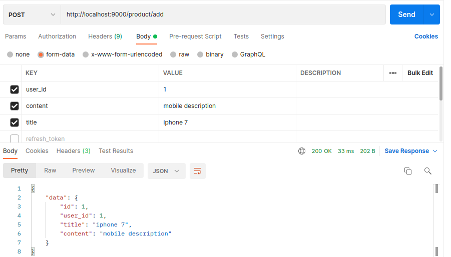
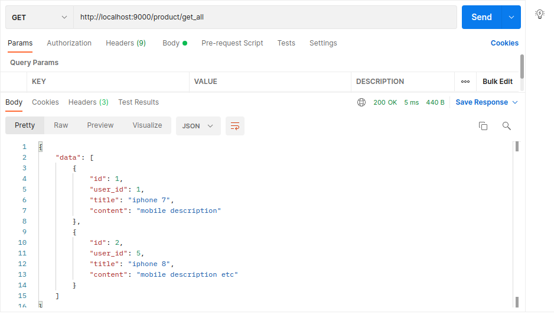
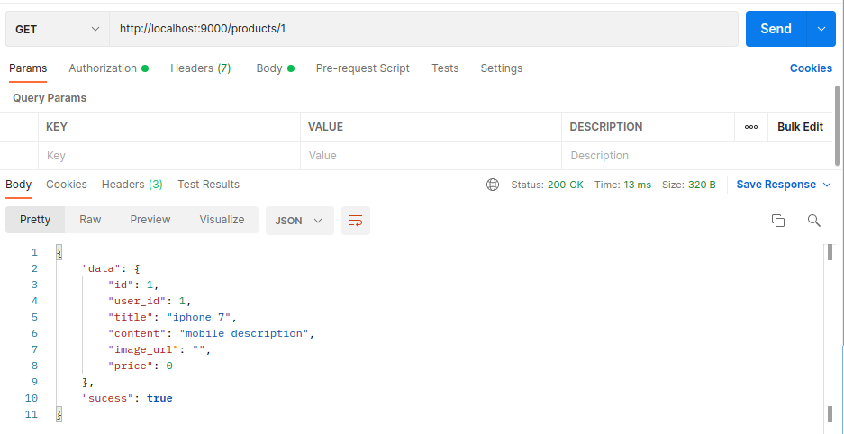
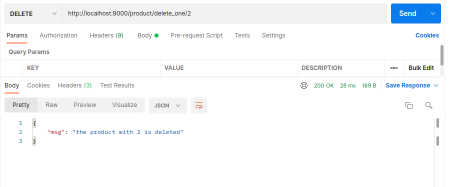

## Table of contents
* [ER Diagram](#er-diagram)
* [Tables](#tables)
* [Register Endpoint](#register-endpoint)
* [login Endpoint](#login-endpoint)
* [Users Endpoint](#users-endpoint)
* [Products Endpoint](#products-endpoint)

## ER Diagram
 

  

 
  

## Tables
 

  

 
  

## Register Endpoint
 
* GET /register
  

  

 
  

## Login Endpoint
 
* GET /login
  

  

 
  

## Users Endpoint
 
* GET /users
  

  

 
  

* GET /users/:id
  

  

 
  

## Products Endpoint
 
* POST /products
  

  

 
  

* GET /products
  

  

 
  

* GET /products/:id
  

  

 
  

* DELETE /products/:id
  

  

 
  
